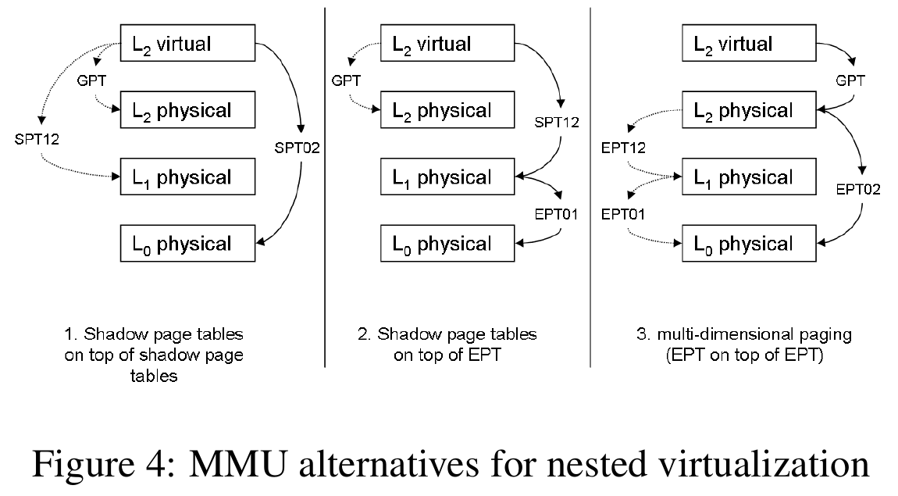

# Nested 虚拟化

## Nested CPU虚拟化

Guest vcpu encounters a privileged instruction when running

1. Guest traps into L0 VMM by VM exit.

2. L0 VMM checks the status, prepare the virtual VMCS, and inject the VM entry
into L1 VMM.

3. L1 VMM emulates this instruction.

4. When finished, L1 VMM call VMRESUME trying back to guest.

5. L0 VMM get the VM exit (due to VMRESUME executed in non-root mode), and
issue real VMRESUME.

6. Guest continues to run instructions.

下面是Turtles中的一个cpuid的例子.

1. L2 executes a cpuid instruction
2. CPU traps and switches to root mode L0
3. L0 switches state from running L2 to running L1
4. CPU switches to guest mode L1
5. L1 modifies VMCS1-2
    repeat n times:
    (a) L1 accesses VMCS1-2
    (b) CPU traps and switches to root mode L0
    (c) L0 emulates VMCS1-2 access and resumes L1
    (d) CPU switches to guest mode L1
6. L1 emulates cpuid for L2
7. L1 executes a resume of L2
8. CPU traps and switches to root mode L0
9. L0 switches state from running L1 to running L2
10. CPU switches to guest mode L2

---

## Nested 内存虚拟化



KVM的nested有三种虚拟化内存的方式.

* Shadow-on-shadow

```
Shadow-on-shadow is used when the processor does not support two-dimensional
page tables, and is the least efficient method. Initially, L0 creates a shadow
page table to run L1 (SPT0-1). L1 , in turn, creates a shadow page table to run
L2 (SPT1-2). L0 cannot use SPT1-2 to run L2 because this table translates L2
guest virtual addresses to L1 host physical addresses. Therefore, L0 compresses
SPT0-1 and SPT1-2 into a single shadow page table, SPT0-2. This new table
translates directly from L2 guest virtual addresses to L0 host physical
addresses. Specifically, for each guest virtual address in SPT1-2, L0 creates
an entry in SPT0-2 with the corresponding L0 host physical address.
```

效率最低的一种方式. 把GPT和SPT1-2压缩成唯一的一个页表: SPT0-2. 只使用一个页表.

* Shadow-on-EPT

```
Shadow-on-EPT is the most straightforward approach to use when the processor
supports EPT. L0 uses the EPT hardware, but L1 cannot use it, so it resorts to
shadow page tables. L1 uses SPT1-2 to run L2 . L0 configures the MMU to use
SPT1-2 as the first translation table and EPT0-1 as the second translation
table. In this way, the processor first translates from L2 guest virtual
address to L1 host physical address using SPT 1-2 , and then translates from
the L1 host physical address to the L0 host physical address using the EPT0-1.
```

使用两个页表: 再L1维护一个SPT1-2, 直接放入cr3. 在L1使用EPT.

* EPT-on-EPT

```
The L0 hypervisor launches L2 with an empty EPT0-2 table, building the table
on-the-fly, on L2 EPT-violation exits. These happen when a translation for a
guest physical address is missing in the EPT table. If there is no translation
in EPT1-2 for the faulting address, L0 first lets L1 handle the exit and update
EPT1-2. L0 can now create an entry in EPT0-2 that translates the L2 guest
physical address directly to the L0 host physical address: EPT1-2 is used to
translate the L2 physical address to a L1 physical address, and EPT0-1
translates that into the desired L0 physical address.

To maintain correctness of EPT0-2 , the L0 hypervisor needs to know of any
changes that L1 makes to EPT1-2.  L0 sets the memory area of EPT1-2 as
read-only, thereby causing a trap when L 1 tries to update it. L0 will then
update EPT0-2 according to the changed entries in EPT1-2.  L0 also needs to
trap all L1 INVEPT instructions, and invalidate the EPT cache accordingly.
```

使用一个页表: 把L0和L1的EPT合并成一个.
