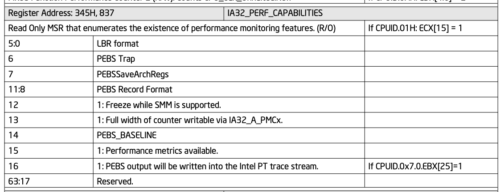

# Intel的Perf Capabilities.



```
610 union perf_capabilities {                          
611         struct {        
612                 u64     lbr_format:6;
613                 u64     pebs_trap:1;
614                 u64     pebs_arch_reg:1;
615                 u64     pebs_format:4;
616                 u64     smm_freeze:1;
617                 /*
618                  * PMU supports separate counter range for writing
619                  * values > 32bit. 
620                  */
621                 u64     full_width_write:1;
622                 u64     pebs_baseline:1;
623                 u64     perf_metrics:1;
624                 u64     pebs_output_pt_available:1;
625                 u64     pebs_timing_info:1;
626                 u64     anythread_deprecated:1;
627         };      
628         u64     capabilities;
629 };
```

默认IA32_PMCx MSRs从0x0c1开始IA32_PERFEVTSELx MSRs从0x186开始.

当full_width_write是1的时候, IA32_PMCx从0x4c1开始.

有一个比较有意思的patch.

[PATCH v2] KVM: x86/pmu: Fix emulation on Intel counters' bit width
https://lore.kernel.org/all/20230322093117.48335-1-likexu@tencent.com/
