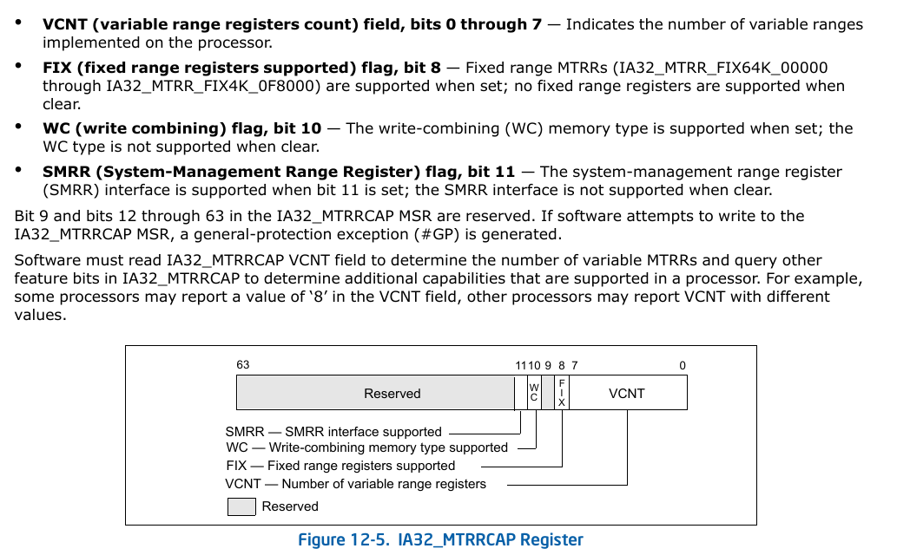
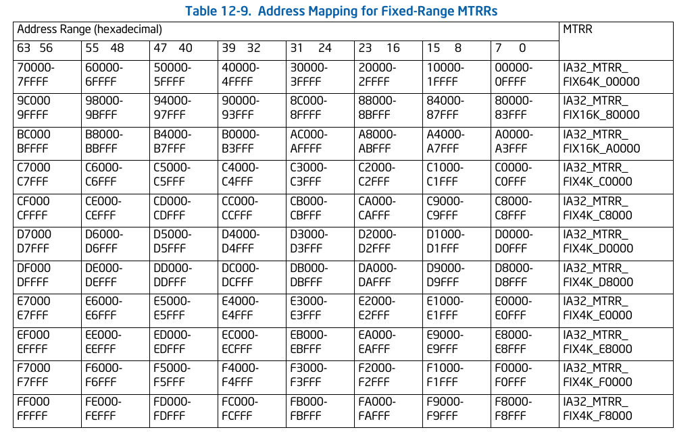
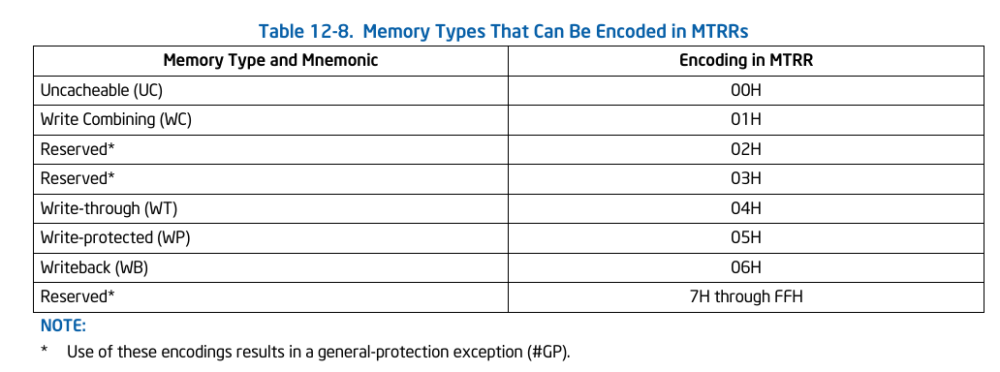
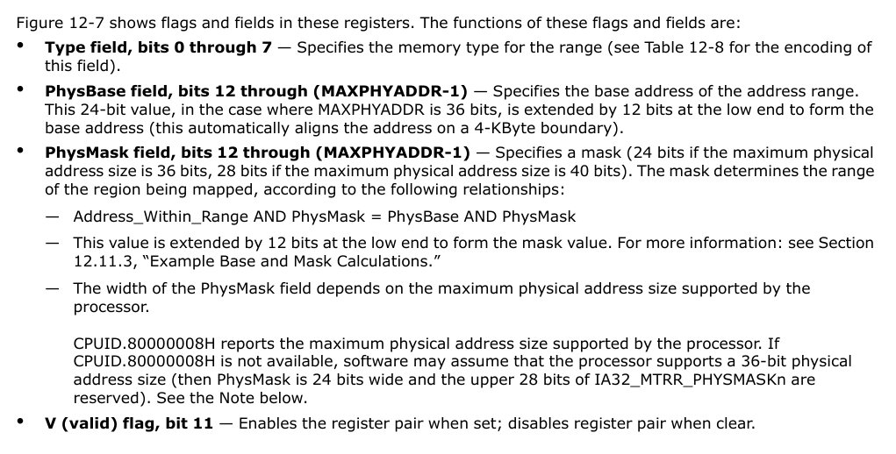
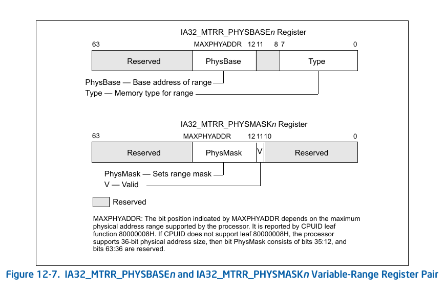
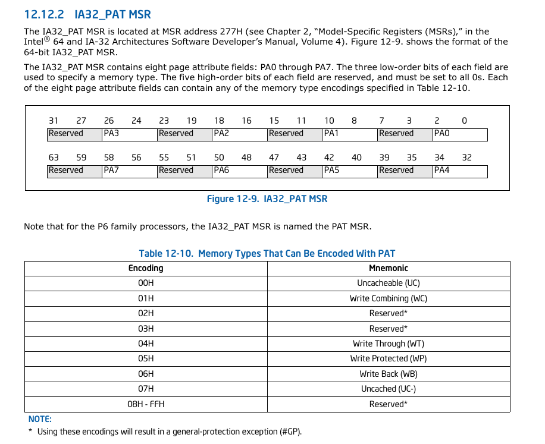
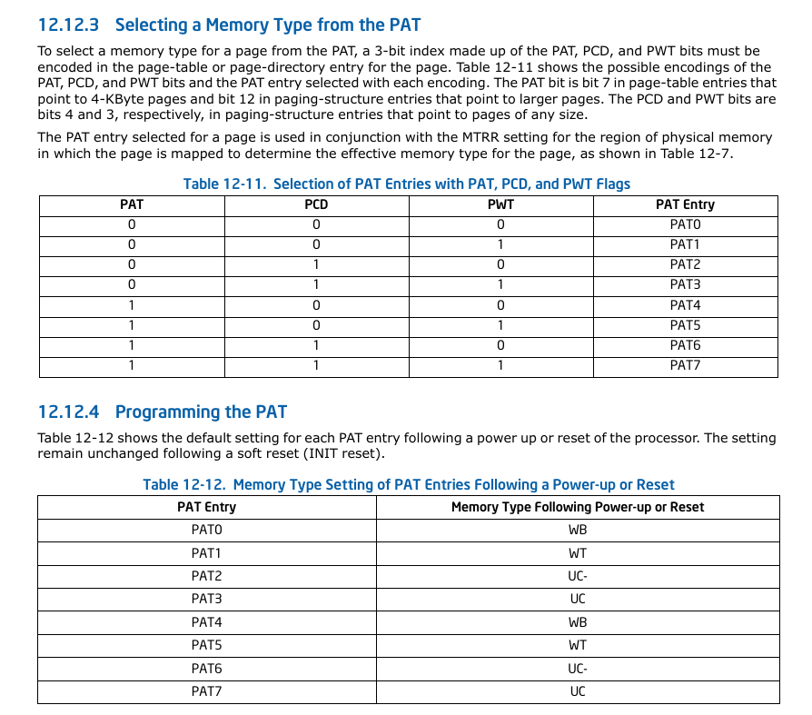
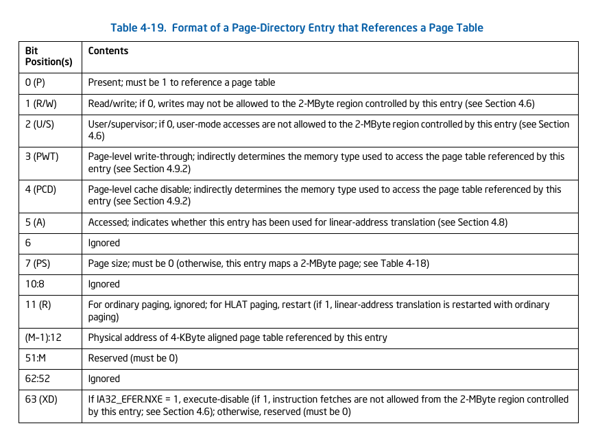
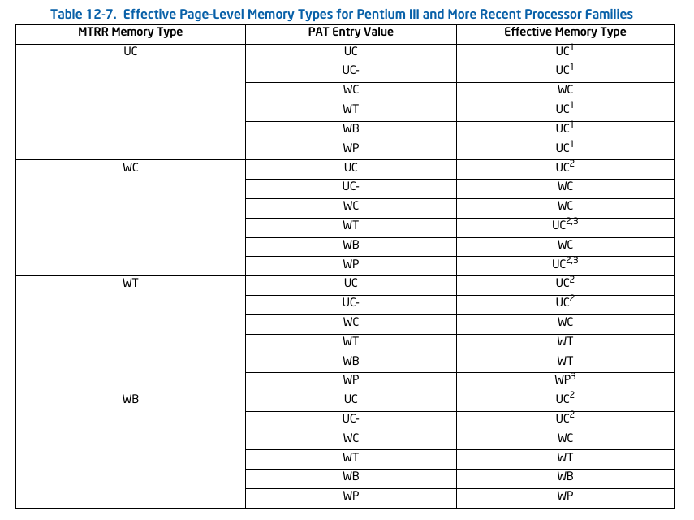
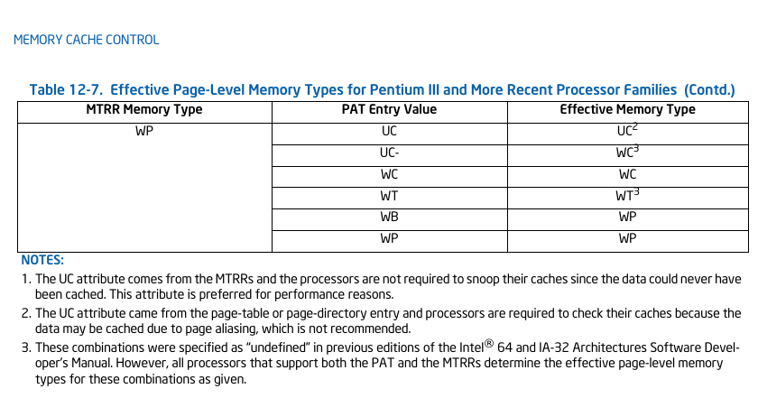

# x86关于MTRRs和PAT

## Cache的类型

* Uncacheable (UC): 所有的read/write都不会经过cached. 经常用在mmio上.
不会re-ordering.

根据Intel SDM, System memory locations are not cached. All reads and writes
appear on the system bus and are executed in program order without reordering.
No speculative memory accesses, page table walks, or prefetches of speculated
branch targets are made. This type of cache-control is useful for memory-mapped
I/O devices. When used with normal RAM, it greatly reduces processor
performance.

* Uncached (UC-): 和UC一样, 只是可以通过MTRR变成WC.

根据Intel SDM,  Has same characteristics as the strong uncacheable (UC) memory
type, except that this memory type can be overridden by programming the MTRRs
for the WC memory type. This memory type is available in processor families
starting from the Pentium III processors and can only be selected through the
PAT.

* Write Combining (WC): 不用L1/L2/L3了, 而且coherency is not enforced by the
processor's bus coherency protocol. 使用自己独立的WC buffer.
似乎read的时候不用WC buffer.

根据Intel SDM, System memory locations are not cached (as with uncacheable
memory) and coherency is not enforced by the processor's bus coherency
protocol. Speculative reads are allowed. Writes may be delayed and combined in
the write combining buffer (WC buffer) to reduce memory accesses.  If the WC
buffer is partially filled, the writes may be delayed until the next occurrence
of a serializing event; such as an SFENCE or MFENCE instruction, CPUID or other
serializing instruction, a read or write to uncached memory, an interrupt
occurrence, or an execution of a LOCK instruction (including one with an
XACQUIRE or XRELEASE prefix). In addition, an execution of the XEND instruction
(to end a transactional region) evicts any writes that were buffered before the
corresponding execution of the XBEGIN instruction (to begin the transactional
region) before evicting any writes that were performed inside the transactional
region.

This type of cache-control is appropriate for video frame buffers, where the
order of writes is unimportant as long as the writes update memory so they can
be seen on the graphics display. See Section 12.3.1, "Buffering of Write
Combining Memory Locations," for more information about caching the WC memory
type. This memory type is available in the Pentium Pro and Pentium II
processors by programming the MTRRs; or in processor families starting from the
Pentium III processors by programming the MTRRs or by selecting it through the
PAT.

* Write Through (WT): 每次write的时候同时write到内存和cache, 保持一致性.

Read: 如果有直接从cache读, 否则miss and fill.
Write: 更新both cache和内存.

根据Intel SDM, Writes and reads to and from system memory are cached. Reads
come from cache lines on cache hits; read misses cause cache fills. Speculative
reads are allowed. All writes are written to a cache line (when possible) and
through to system memory. When writing through to memory, invalid cache lines
are never filled, and valid cache lines are either filled or invalidated. Write
combining is allowed. This type of cache-control is appropriate for frame
buffers or when there are devices on the system bus that access system memory,
but do not perform snooping of memory accesses. It enforces coherency between
caches in the processors and system memory.

* Write Back (WB): 最常见的, write的时候先写入cache, 稍后再sync到内存.

Read: 如果有直接从cache读, 否则miss and fill.

根据Intel SDM, Writes and reads to and from system memory are cached. Reads
come from cache lines on cache hits; read misses cause cache fills. Speculative
reads are allowed. Write misses cause cache line fills (in processor families
starting with the P6 family processors), and writes are performed entirely in
the cache, when possible. Write combining is allowed. The write-back memory
type reduces bus traffic by eliminating many unnecessary writes to system
memory. Writes to a cache line are not immediately forwarded to system memory;
instead, they are accumulated in the cache. The modified cache lines are
written to system memory later, when a write-back operation is performed.
Write-back operations are triggered when cache lines need to be deallocated,
such as when new cache lines are being allocated in a cache that is already
full. They also are triggered by the mechanisms used to maintain cache
consistency. This type of cache-control provides the best performance, but it
requires that all devices that access system memory on the system bus be able
to snoop memory accesses to ensure system memory and cache coherency.

* Write Protected (WP): 读和WB一样, 写的时候会把system
bus上其他的CPU的对应的cache line invalidate. 

根据Intel SDM, Reads come from cache lines when possible, and read misses cause
cache fills.  Writes are propagated to the system bus and cause corresponding
cache lines on all processors on the bus to be invalidated. Speculative reads
are allowed. This memory type is available in processor families starting from
the P6 family processors by programming the MTRRs (see Table 12-6).

---

## MTRRs (Memory Type Range Registers) --> 使用物理地址

* MTTRs的检测.

使用CPUID MTRR flag (bit 12) in the feature information register (EDX).

```shell
$ cpuid -1 -l 0x1
CPU:
... ...
   feature information (1/edx):
      x87 FPU on chip                        = true
      VME: virtual-8086 mode enhancement     = true
      DE: debugging extensions               = true
      PSE: page size extensions              = true
      TSC: time stamp counter                = true
      RDMSR and WRMSR support                = true
      PAE: physical address extensions       = true
      MCE: machine check exception           = true
      CMPXCHG8B inst.                        = true
      APIC on chip                           = true
      SYSENTER and SYSEXIT                   = true
      MTRR: memory type range registers      = true
```

如果支持, 可以读取IA32_MTRRCAP这个MSR获取更多的信息, 比如: 支持的range的数目,
或者是是否支持WC.



* MTRRs的设置. 通过下面的三个MSR.

1. IA32_MTRR_DEF_TYPE MSR

2. 一些Fixed Range MTRRs: IA32_MTRR_FIX64K_00000, IA32_MTRR_FIX16K_80000,
IA32_MTRR_FIX16K_A0000等11个64-bit的寄存器. 但是只能控制比较小的range.  This
range is divided into sixteen 16-KByte sub-ranges, 8 ranges per register.



下面是每8个bit的对应range的encoding.



3. Variable Range MTRRs. 数量由IA32_MTRRCAP决定. encoding和上面一样.





---

## PAT (PAGE ATTRIBUTE TABLE) --> 使用Linear address

* PAT的检测

The Page Attribute Table (PAT) extends the IA-32 architecture's page-table
format to allow memory types to be assigned to regions of physical memory based
on linear address mappings. The PAT is a companion feature to the MTRRs; that
is, the MTRRs allow mapping of memory types to regions of the physical address
space, where the PAT allows mapping of memory types to pages within the linear
address space. The MTRRs are useful for statically describing memory types for
physical ranges, and are typically set up by the system BIOS. The PAT extends
the functions of the PCD and PWT bits in page tables to allow all five of the
memory types that can be assigned with the MTRRs (plus one additional memory
type) to also be assigned dynamically to pages of the linear address space.

```shell
$ cpuid -1 -l 0x1
CPU:
... ...
   feature information (1/edx):
      x87 FPU on chip                        = true
      VME: virtual-8086 mode enhancement     = true
      DE: debugging extensions               = true
      PSE: page size extensions              = true
      TSC: time stamp counter                = true
      RDMSR and WRMSR support                = true
      PAE: physical address extensions       = true
      MCE: machine check exception           = true
      CMPXCHG8B inst.                        = true
      APIC on chip                           = true
      SYSENTER and SYSEXIT                   = true
      MTRR: memory type range registers      = true
      PTE global bit                         = true
      MCA: machine check architecture        = true
      CMOV: conditional move/compare instr   = true
      PAT: page attribute table              = true
```

* PAT的配置

如果支持, 用IA32_PAT MSR进行配置. 使用下面的table配置每一个index,
然后在页表里面索引这些index. 通过页表的PAT(bit=7), PCD和PWD进行索引.



如果支持PAT, 在页表索引的方式. (第二个表是默认的配置).



* 如果不支持PAT

如果不支持PAT, 就只能使用页表最普通的方式了.



* PAT的dump

```shell
# cat /sys/kernel/debug/x86/pat_memtype_list
PAT memtype list:
PAT: [mem 0x00000000869fb000-0x0000000086a8c000] write-back
PAT: [mem 0x0000000086b43000-0x0000000086b44000] write-back
... ...
PAT: [mem 0x00000000916ae000-0x00000000916af000] write-back
PAT: [mem 0x00000000a0800000-0x00000000a0801000] uncached-minus
PAT: [mem 0x00000000bc200000-0x00000000bc202000] uncached-minus
... ...
PAT: [mem 0x00000000feddd000-0x00000000fedde000] uncached-minus
PAT: [mem 0x0000004000000000-0x0000004010000000] write-combining
PAT: [mem 0x0000004017000000-0x0000004017001000] uncached
PAT: [mem 0x0000004017000000-0x0000004017001000] uncached
PAT: [mem 0x0000004017000000-0x0000004017001000] uncached
PAT: [mem 0x000000603c000000-0x000000603c200000] uncached-minus
... ...
PAT: [mem 0x000000603d1d1000-0x000000603d1d2000] uncached-minus
```
---

## MTRR和PAT的生效组合

下面的table来自Intel SDM, 是Selecting Memory Types for Pentium III and More
Recent Processor Families. 更早的CPU在SDM有其他的table.





## Memory type的API

https://www.kernel.org/doc/Documentation/x86/pat.txt

上面的doc建议了一些API, 下面的table是一个例子.

```shell
-------------------------------------------------------------------
API                    |    RAM   |  ACPI,...  |  Reserved/Holes  |
-----------------------|----------|------------|------------------|
                       |          |            |                  |
ioremap                |    --    |    UC-     |       UC-        |
                       |          |            |                  |
ioremap_cache          |    --    |    WB      |       WB         |
                       |          |            |                  |
ioremap_uc             |    --    |    UC      |       UC         |
                       |          |            |                  |
ioremap_nocache        |    --    |    UC-     |       UC-        |
                       |          |            |                  |
ioremap_wc             |    --    |    --      |       WC         |
                       |          |            |                  |
ioremap_wt             |    --    |    --      |       WT         |
                       |          |            |                  |
set_memory_uc          |    UC-   |    --      |       --         |
 set_memory_wb         |          |            |                  |
                       |          |            |                  |
set_memory_wc          |    WC    |    --      |       --         |
 set_memory_wb         |          |            |                  |
                       |          |            |                  |
set_memory_wt          |    WT    |    --      |       --         |
 set_memory_wb         |          |            |                  |
                       |          |            |                  |
pci sysfs resource     |    --    |    --      |       UC-        |
                       |          |            |                  |
pci sysfs resource_wc  |    --    |    --      |       WC         |
 is IORESOURCE_PREFETCH|          |            |                  |
                       |          |            |                  |
pci proc               |    --    |    --      |       UC-        |
 !PCIIOC_WRITE_COMBINE |          |            |                  |
                       |          |            |                  |
pci proc               |    --    |    --      |       WC         |
 PCIIOC_WRITE_COMBINE  |          |            |                  |
                       |          |            |                  |
/dev/mem               |    --    |  WB/WC/UC- |    WB/WC/UC-     |
 read-write            |          |            |                  |
                       |          |            |                  |
/dev/mem               |    --    |    UC-     |       UC-        |
 mmap SYNC flag        |          |            |                  |
                       |          |            |                  |
/dev/mem               |    --    |  WB/WC/UC- |    WB/WC/UC-     |
 mmap !SYNC flag       |          |(from exist-|  (from exist-    |
 and                   |          |  ing alias)|    ing alias)    |
 any alias to this area|          |            |                  |
                       |          |            |                  |
/dev/mem               |    --    |    WB      |       WB         |
 mmap !SYNC flag       |          |            |                  |
 no alias to this area |          |            |                  |
 and                   |          |            |                  |
 MTRR says WB          |          |            |                  |
                       |          |            |                  |
/dev/mem               |    --    |    --      |       UC-        |
 mmap !SYNC flag       |          |            |                  |
 no alias to this area |          |            |                  |
 and                   |          |            |                  |
 MTRR says !WB         |          |            |                  |
                       |          |            |                  |
-------------------------------------------------------------------
```
